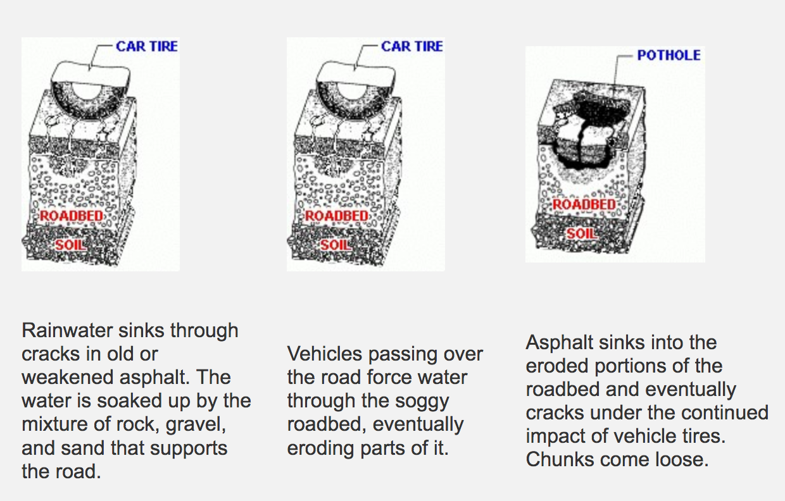
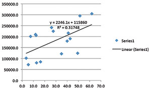

# Plugging up Potholes with Data {#Preventing-Potholes}

#### Keywords {-}

Potholes, Data Science, Fixing, Preemptive, Weather, Urban Improvement

## Nuisances of the Road.

Potholes: the asphalt nuisances that the everyday driver would have to dodge or else suffer an uncomfortable bump and the unease of possible damage done to their tires or rims. But a popped tire is the least of our problems when driving through a large pothole at the right speed may cause potentially fatal accidents. Current systems mostly rely on drivers reporting a pothole to the government usually before filing an insurance claim. In this case, it's already too late because the pothole has already grown to a size where it can cause real damage to cars and be substantially costly to fix. In addition, it can take an average of 5.5 days in an affluent neighborhood in a state like Indiana for the repairs to start. In the poorer neighborhoods, it can take up to an average of 19 days (cite Indy Star). This can lead to a lot of discontent for the population of a city or town. Therefore, being able to fix cracks and small potholes before they grow would not only be beneficial for the drivers, but also for the government officials responsible for maintaining road quality. Imagine driving in your city or town and never encountering a pothole large enough to bother you. The resulting uptick in quality of life would theoretically translate to the popularity of the government official. By leveraging data science, it is possible to predict when a pothole is going to form and preemptively find and fix them when they are still small or merely cracks in the road.

## Learn, Execute, and Keep Learning!

The first step would be figuring out the basics with the information we have. Before we can predict when a pothole will form, we must first understand how they are formed. As roads get old, they usually suffer a degree of wear and tear as cracks start to emerge. In colder climates, as water seeps into these cracks and freeze, they will expand and subsequently compromise the integrity of the road much faster than usual. Many repetitions of this freezing and melting, combined with the weight of the cars passing over, will cause the road to weaken, crack and eventually form a pothole (cite summitengineer). Therefore, to predict when a pothole may form, we would need data on the weather, such as precipitation or snowfall. Temperature data would also be required to determine whether the water would freeze in the given area. Past maintenance records along with weather patterns should be studied and modeled to figure out the impact of each factor in creating a pothole.

```{r potholes-forming,echo=FALSE,fig.cap='[Figure 1: How Potholes Form](http://www.summitengineer.net/resources/learning/52-potholes)',fig.align='right',out.width='50%'}

```
[cite summitengineer]

```{r snowfall-data,echo=FALSE,fig.cap='[Figure 2: Number of potholes as a result of inches of snow](https://www.informs.org/ORMS-Today/Public-Articles/June-Volume-41-Number-3/POTHOLE-ANALYTICS)',fig.align='left',out.width='50%'}

```
[cite Pothole Analytics]

The next step would be learning through execution. After we have some form of model, we can start preemptively fixing potholes but also build upon the model with new data. For example, it would be useful to have access to the average traffic of the area. This can be done by using traffic cameras to determine the average number of cars driving on the road in one day. Also, the number of trucks and busses can also be obtained in a similar way. This data might even be readily available because bus and truck routes are usually recorded. Other information such as the last date the road was inspected and repaired, the type of materials the road was paved with, and the frequency in which the road has to be repaired in the past should be integrated into the model in order to enhances the predictive accuracy.

Using all this data, the model should be able to predict when a pothole may form so that officials can survey the road and fix any small potholes or cracks before they mature into a hindrance. Roads can also be ranked by priority in terms of the likelihood of developing potholes as well as the density of the traffic on that road. As a result, surveillance is only done when necessary, saving time and resources, but at the same time done early enough so that no pothole can grow to a size that bothers the drivers and is expensive to fix. 


## All about efficiency and Preemptive strikes.

This approach however, does come with some limitations. No model is perfect, and no data is ever complete. Roads in some poorer neighborhoods might have fewer traffic cameras and therefore have incomplete data to work with. Consequently, the model might interpret these roads as lower priority based on the lack of data. It would be up to the government officials to realize and address these imperfections such as putting up a traffic camera where it's needed. Furthermore, this preemptive solution might not even be an option for some cities that are already far behind in filling in existing potholes. It's hard to find the time and resources to fill in potholes before they form when existing potholes haven't been addressed yet. My recommendation is to tackle both problems simultaneously. Spend half of the time filling in existing potholes and the other half, preventing potholes from forming. Hopefully, the decreased rate in which large potholes form would give the city some breathing room to fill in existing potholes.

On the whole however, especially in cities suited for this implementation, preemptively filling in potholes would not only increase quality of life and the popularity of the government officials, but also save the city some money. According to the director of the National Center for Pavement Preservation, "the cost of addressing minor deficiencies is much less than addressing major deficiencies" (cite preventing and repairing potholes). Furthermore, Pothole.info claims that "failure to spend $1 in road repair typically results in $7 of cost five years later" (cite Pothole.info). It is true that implementing a data science system would cost money, but an early investment in fixing a problem can save a lot of money down the road.
